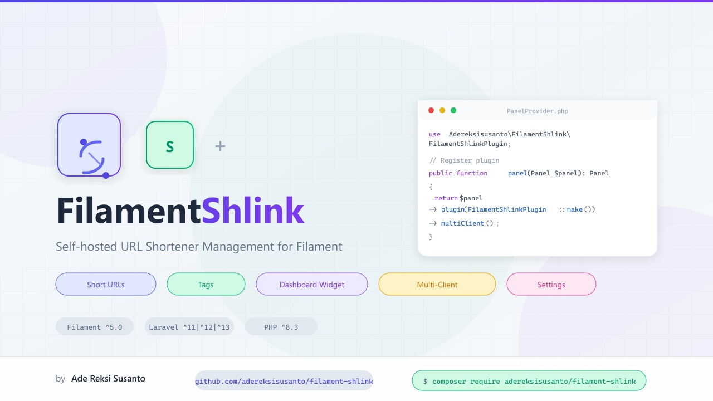

# Filament Shlink

[](https://packagist.org/packages/adereksisusanto/filament-shlink)
[](https://github.com/adereksisusanto/filament-shlink/actions/workflows/tests.yml)
[](https://github.com/adereksisusanto/filament-shlink/actions/workflows/fix-code-style.yml)
[](https://packagist.org/packages/adereksisusanto/filament-shlink)

<p align="center">
  
</p>

Filament panel integration for [Shlink](https://shlink.io), a self-hosted URL shortener. Manage short URLs and tags directly from your Filament panel.

## Installation

```bash
composer require adereksisusanto/filament-shlink
```

### Publish Config

```bash
php artisan vendor:publish --tag="filament-shlink-config"
```

### Register Plugin

```php
// AppServiceProvider.php or PanelProvider
use Adereksisusanto\FilamentShlink\FilamentShlinkPlugin;

public function panel(Panel $panel): Panel
{
    return $panel
        ->plugin(FilamentShlinkPlugin::make());
}
```

### Modal Mode

By default, create and edit actions navigate to dedicated pages. To use modal forms instead:

```php
FilamentShlinkPlugin::make()->modal(true)
```

Configure modal appearance with named parameters using enums:

```php
use Adereksisusanto\FilamentShlink\Enums\ModalType;
use Filament\Support\Enums\Alignment;
use Filament\Support\Enums\SlideOverPosition;
use Filament\Support\Enums\Width;

FilamentShlinkPlugin::make()->modal(
    enabled: true,
    type: ModalType::SlideOver,
    position: SlideOverPosition::End,
    width: Width::FourExtraLarge,
    alignment: Alignment::Center,
)
```

### Multi-Client (Per-User Config)

Enable per-user Shlink connections. Each authenticated user can configure their own Shlink server via **Shlink Settings**:

```php
FilamentShlinkPlugin::make()->multiClient()
```

Customize the database table prefix:

```php
FilamentShlinkPlugin::make()->multiClient(tablePrefix: 'myapp')
```

This creates the `myapp_configs` table (default `fs_configs`). When enabled, publish & run the migration:

```bash
php artisan vendor:publish --tag="filament-shlink-migrations"
php artisan migrate
```

Per-user data is scoped per user. Falls back to global `.env` config if user has no saved config.

## Configuration

Set your Shlink server URL and API key in `.env`:

```env
SHLINK_SERVER_URL=https://your-shlink-server.com
SHLINK_API_KEY=your-api-key
```

Or configure them via **Shlink Settings** page in the Filament admin panel after registration.

Published config (`config/filament-shlink.php`):

```php
return [
    'server_url' => env('SHLINK_SERVER_URL', ''),
    'api_key' => env('SHLINK_API_KEY', ''),
    'table_prefix' => 'fs',
];
```

## Translations

Available in **46 languages**. The plugin auto-detects the app locale and loads the corresponding translation file:

| # | Locale | Language |
|---|--------|----------|
| 1 | `af` | Afrikaans |
| 2 | `ar` | العربية (Arabic) |
| 3 | `bg` | Български (Bulgarian) |
| 4 | `bn` | বাংলা (Bengali) |
| 5 | `ca` | Català (Catalan) |
| 6 | `cs` | Čeština (Czech) |
| 7 | `da` | Dansk (Danish) |
| 8 | `de` | Deutsch (German) |
| 9 | `el` | Ελληνικά (Greek) |
| 10 | `en` | English |
| 11 | `es` | Español (Spanish) |
| 12 | `et` | Eesti (Estonian) |
| 13 | `fa` | فارسی (Persian) |
| 14 | `fi` | Suomi (Finnish) |
| 15 | `fil` | Filipino |
| 16 | `fr` | Français (French) |
| 17 | `he` | עברית (Hebrew) |
| 18 | `hi` | हिन्दी (Hindi) |
| 19 | `hr` | Hrvatski (Croatian) |
| 20 | `hu` | Magyar (Hungarian) |
| 21 | `id` | Bahasa Indonesia (Indonesian) |
| 22 | `it` | Italiano (Italian) |
| 23 | `ja` | 日本語 (Japanese) |
| 24 | `ko` | 한국어 (Korean) |
| 25 | `lt` | Lietuvių (Lithuanian) |
| 26 | `lv` | Latviešu (Latvian) |
| 27 | `ms` | Bahasa Melayu (Malay) |
| 28 | `nb` | Norsk Bokmål (Norwegian) |
| 29 | `nl` | Nederlands (Dutch) |
| 30 | `pl` | Polski (Polish) |
| 31 | `pt` | Português (Portuguese) |
| 32 | `pt_BR` | Português (Brasil) |
| 33 | `ro` | Română (Romanian) |
| 34 | `ru` | Русский (Russian) |
| 35 | `sk` | Slovenčina (Slovak) |
| 36 | `sl` | Slovenščina (Slovenian) |
| 37 | `sr` | Srpski (Serbian) |
| 38 | `sv` | Svenska (Swedish) |
| 39 | `sw` | Kiswahili (Swahili) |
| 40 | `th` | ไทย (Thai) |
| 41 | `tr` | Türkçe (Turkish) |
| 42 | `uk` | Українська (Ukrainian) |
| 43 | `ur` | اردو (Urdu) |
| 44 | `vi` | Tiếng Việt (Vietnamese) |
| 45 | `zh_CN` | 简体中文 (Chinese Simplified) |
| 46 | `zh_TW` | 繁體中文 (Chinese Traditional) |

Translation files are located at `resources/lang/{locale}/filament-shlink.php`. To add a new language, copy the `en` file and translate the values.

## Features

- **Short URLs** — List, create, and edit short URLs
- **Tags** — List, rename, and delete tags
- **Dashboard Widget** — Visits overview widget showing total visits, short URLs, and tags
- **Settings** — Configure server connection from the admin panel
- **Multi-Client** — Per-user Shlink connections (stored in `{prefix}_configs`)

## Usage

Once registered, the plugin adds the following to your Filament panel:

- **Dashboard Widget** — `VisitsOverviewWidget` displays total visits, short URL count, and tag count (appears on the Short URLs page)
- **Short URLs** — View all short URLs, create new ones, edit existing ones
- **Tags** — Manage tags (rename, delete)

> Shlink URLs, tags, and visits are fetched directly from the Shlink API — no local tables for those. When `multiClient()` is enabled, per-user connection settings are stored in the `{prefix}_configs` table.

## Requirements

- PHP ^8.3
- Filament ^5.0
- Laravel ^11.0|^12.0|^13.0

## Testing

```bash
composer test
```

The test suite covers:

- **Models** — ShortUrl, Tag, and TagStats creation from Shlink SDK DTOs
- **Service** — Configuration state, connection setup via `setConfig()`
- **Widget** — Visits overview widget handles configured and unconfigured states
- **Service Provider** — Singleton registration, config/translation/view loading
- **Architecture** — Debug functions (`dd`, `dump`, `ray`) are not used anywhere in the source

## Changelog

Please see [CHANGELOG](CHANGELOG.md) for more information on what has changed recently.

## Contributing

Please see [CONTRIBUTING](.github/CONTRIBUTING.md) for details.

## Security Vulnerabilities

Please review [our security policy](.github/SECURITY.md) on how to report security vulnerabilities.

## Credits

- [Ade Reksi Susanto](https://github.com/adereksisusanto)
- [All Contributors](../../contributors)

## License

The MIT License (MIT). Please see [License File](LICENSE.md) for more information.
